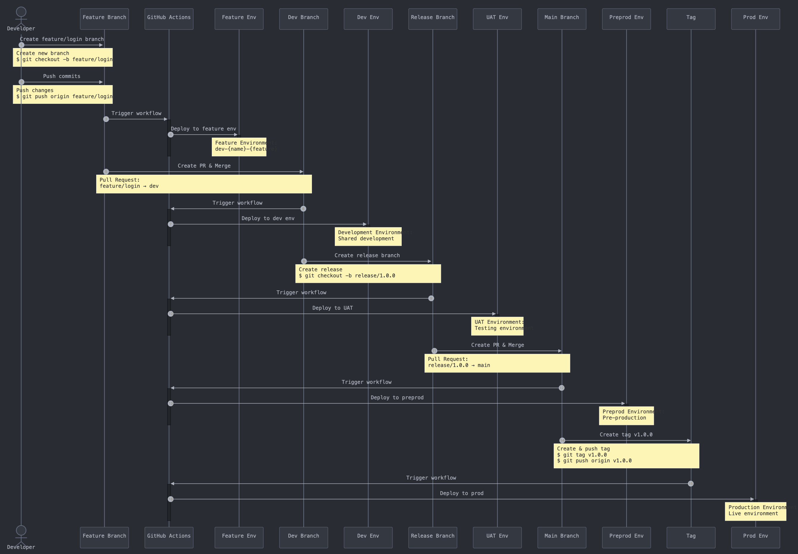

# GitFlow Deployment Process

This repository follows GitFlow branching strategy for deployment with automated GitHub Actions workflows.

## Gitflow Sequence Diagram



## Table of Contents

- [GitFlow Deployment Process](#gitflow-deployment-process)
  - [Gitflow Sequence Diagram](#gitflow-sequence-diagram)
  - [Table of Contents](#table-of-contents)
  - [Branch Strategy](#branch-strategy)
    - [Overview](#overview)
    - [Main Branches](#main-branches)
    - [Supporting Branches](#supporting-branches)
  - [Environment Mapping](#environment-mapping)
  - [State Management](#state-management)
  - [Development Workflow](#development-workflow)
    - [1. Start New Feature](#1-start-new-feature)
    - [2. Work on Feature](#2-work-on-feature)
    - [3. Create Pull Request](#3-create-pull-request)
    - [4. After PR Merge](#4-after-pr-merge)
    - [5. Release Process](#5-release-process)
    - [6. Hotfix Process](#6-hotfix-process)
  - [Environment Cleanup](#environment-cleanup)
  - [Deployment Rules](#deployment-rules)
    - [1. Production Deployments](#1-production-deployments)
    - [2. UAT Deployments](#2-uat-deployments)
    - [3. Development Deployments](#3-development-deployments)
  - [Required Secrets](#required-secrets)
  - [Local Development](#local-development)
    - [1. Repository Setup](#1-repository-setup)
    - [2. Development Tools](#2-development-tools)
    - [3. GitHub Repository Secrets](#3-github-repository-secrets)
  - [Best Practices](#best-practices)
    - [1. Branch Naming](#1-branch-naming)
    - [2. Version Tagging](#2-version-tagging)
    - [3. Commit Messages](#3-commit-messages)
    - [4. Tag Management](#4-tag-management)
  - [Troubleshooting](#troubleshooting)
    - [Common Issues](#common-issues)
  - [Support](#support)

## Branch Strategy

### Overview

```plaintext
                       v1.0.0    v1.0.1                           v1.1.0   v1.2.0
                        ↓         ↓                                ↓       ↓
Production   main       o---------o--------------------------------o-------o---
                        |\       /                                /       /
Hotfix       hotfix/*   | o--o--o                                /       /
                        |        \                              /       /
Releases     release/*  |         \            o---o---o---o---o       o
                        |          \          /         \       \     / \
Development  dev        o---o---o---o-----o--o---o---o---o---o---o---o---o-----
                                 \       /                          /
Feature      feature/*            o--o--o                          /
                                   \                              /
Feature      feature/*              o---o---o---o---o---o----o---o
```

### Main Branches

```plaintext
main    o---------o---------o---------o  (Production stable code)
        ↑         ↑         ↑         ↑
      v1.0.0    v1.1.0    v1.2.0    v1.2.1


dev     o---o---o---o---o---o---o---o  (Integration branch)
        ↑   ↑   ↑   ↑   ↑   ↑   ↑   ↑
        Features merge here first
```

- `main`: Production-ready code with version tags

  - All production releases are tagged here
  - No direct commits allowed
  - Merges only from release/_ or hotfix/_ branches

- `dev`: Development integration branch

  - All features integrate here first
  - Continuous integration testing
  - Source for release branches

### Supporting Branches

```plaintext
feature/login      o---o---o  (New features)
                   ↑
         git checkout -b feature/login
```

```plaintext
                           (Create tag here)
main                           o
                              /
release/1.0.0            o---o  (Release preparation)
                        /     \
dev    o---o---o---o---o       o (Merges to both main & dev)
```

```plaintext
            o---------o          o  (Create tag here)
main                   \        /
                        \      /
hotfix/1.0.1             o---o  (Emergency fixes to both main & dev)
                              \
dev                            o
```

- `feature/*` - New features
- `release/*` - Release preparation
- `hotfix/*` - Emergency fixes
- Tags (e.g., `v1.0.0`) - Production releases

- `feature/*`: New feature development

  - Branched from: dev
  - Merges to: dev
  - Naming: feature/descriptive-name

- `release/*`: Release preparation

Branched from: dev
Merges to: main (with tag) and dev
Naming: release/x.y.z

hotfix/\*: Emergency fixes

Branched from: main
Merges to: main (with tag) and dev
Naming: hotfix/x.y.z

Tags (v\*..)

Created on: main branch only
Format: vX.Y.Z (e.g., v1.2.0)
Represents: Production releases

## Environment Mapping

| Branch/Tag      | Environment             | Purpose                | Auto Deploy |
| --------------- | ----------------------- | ---------------------- | ----------- |
| `v*.*.*` (tags) | `prod`                  | Production release     | ✅           |
| `main`          | `preprod`               | Production code base   | ✅           |
| `dev`           | `dev`                   | Shared development     | ✅           |
| `release/*`     | `uat`                   | Release testing        | ✅           |
| `hotfix/*`      | `hotfix`                | Hotfix testing         | ✅           |
| `feature/*`     | `{developer}-{feature}` | Individual development | ✅           |

## State Management

```plaintext
terraform-state-bucket/
├── prod/                          # Production state
│   └── greeting-function/         # From tags (v*.*.*)
│
├── uat/                           # UAT states
│   └── greeting-function/         # From release/* & hotfix/*
│ 
├── dev/                           # Development states
│   └── greeting-function/         # From dev branch
│
├── features/                      # Feature states
│   ├── greeting-function/         # Repository
│   │   ├── kenanhancer/           # Developer-specific
│   │   │   └── say-hello/         # Feature name
│   │   │   └── say-goodbye/       # Feature name
│   │   │
│   │   └── jondoe/                # Developer-specific
│   │       └── say-hello-v2/      # Feature name
│   │
│   └── weather-function/          # Repository
│       └── janesmith/             # Developer-specific
│           └── weather-quality/   # Feature name
```

## Development Workflow

### 1. Start New Feature

```plaintext
dev            o-----o-----o
                      \
feature/login          o     ← You are here
                       ↑
                   git checkout -b feature/login

Commands:
git checkout dev
git pull origin dev
git checkout -b feature/login

Environment: Creates dev-johndoe-login
```

### 2. Work on Feature

```plaintext
dev            o-----o-----o
                      \
feature/login          o--→--o--→--o
                       ↑     ↑     ↑
                     commit  push  push

Commands:
git checkout feature/login
git add .
git commit -m "Add feature"
git push origin feature/login

Environment: Updates dev-johndoe-login
```

### 3. Create Pull Request

```plaintext
dev            o-----o-----o     ← PR
                            \      ↑
feature/login                o-----o
                                   ↑
                                 ready

Action: Create PR feature/login → dev
Environment: Maintains dev-johndoe-login
```

### 4. After PR Merge

```plaintext
dev            o-----o-----o-----o------o
                            \           ↑
feature/login                o-----o----x
                                        ↑
                                      merged

Result:
- Updates dev environment
- Cleans up dev-johndoe-login
```

### 5. Release Process

```plaintext
                                                tag: v1.0.0
main              o---------------------------------o
                                                   /
release/1.0.0                               o-----o
                                           /       \
dev               o-----o-----o-----o-----o---------o
                                          ↑
                                       PR merged

Commands:
git checkout dev
git checkout -b release/1.0.0
# After testing in UAT
git checkout main
git merge release/1.0.0
git tag -a v1.0.0 -m "Release 1.0.0"
git push origin v1.0.0
```

### 6. Hotfix Process

```plaintext
                           tag: v1.0.1
main          o---------------o
               \             /
hotfix/1.0.1    o-----o-----o
                ↑     ↑     ↑\
             bug fix          \
                               \
dev           o-----o-----o-----o

Commands:
git checkout main
git checkout -b hotfix/1.0.1
# Fix critical bug
git tag -a v1.0.1 -m "Hotfix 1.0.1"
git push origin v1.0.1
```

## Environment Cleanup

```plaintext
Feature Branch Deleted:
dev-johndoe-login    x    (Automatically destroyed)

PR Merged:
feature/login        o----x
dev-johndoe-login    x    (Automatically destroyed)

PR Closed:
feature/login        o----x
dev-johndoe-login    x    (Automatically destroyed)
```

## Deployment Rules

### 1. Production Deployments

```plaintext
                      Requires tag
main        o-----------------o
                              ↑
                           v1.0.0    ─→ Deploys to prod
```

### 2. UAT Deployments

```plaintext
release/1.0.0    o-----o    ─→ Auto deploys to UAT
hotfix/1.0.1     o-----o    ─→ Auto deploys to UAT
```

### 3. Development Deployments

```plaintext
dev               o-----o    ─→ Auto deploys to dev
feature/login     o-----o    ─→ Auto deploys to dev-johndoe-login
```

## Required Secrets

```plaintext
GitHub Repository
└── Settings
    └── Secrets and variables
        └── Actions
            ├── GOOGLE_CREDENTIALS
            ├── GCP_PROJECT_ID
            ├── GCP_REGION
            └── TF_STATE_BUCKET
```

## Local Development

### 1. Repository Setup

```plaintext
Local Machine
└── my_gcp_function/
    ├── .git/
    ├── src/
    ├── terraform/
    └── .github/
        └── workflows/

Commands:
git clone [repository-url]
cd [repository-name]
```

### 2. Development Tools

```bash
# Install required tools
brew install terraform
brew install google-cloud-sdk

# Configure GCP
gcloud auth application-default login
gcloud config set project [PROJECT_ID]
```

### 3. GitHub Repository Secrets

```plaintext
GOOGLE_CREDENTIALS   # GCP Service Account key
GCP_PROJECT_ID      # Google Cloud Project ID
GCP_REGION          # Default GCP region
TF_STATE_BUCKET     # Terraform state bucket
```

## Best Practices

### 1. Branch Naming

```plaintext
✅ feature/login-page
❌ feature/login_page
❌ feat/login
❌ login

✅ release/1.0.0
❌ release-1.0.0
❌ rel/1.0.0

✅ hotfix/1.0.1
❌ fix/1.0.1
```

### 2. Version Tagging

```plaintext
✅ v1.2.0  # Major.Minor.Patch
✅ v0.1.0  # Pre-1.0 release
❌ 1.2.0   # Missing v prefix
❌ ver1.2  # Incorrect format
```

### 3. Commit Messages

```plaintext
✅ feat: add user authentication
✅ fix: correct login validation
✅ docs: update deployment guide
❌ update code
❌ fix bug
❌ quick fix
```

### 4. Tag Management

```bash
# Creating tags
git tag -a v1.2.0 -m "Release version 1.2.0"
git push origin v1.2.0

# Listing tags
git tag -l "v*"

# Viewing tag details
git show v1.2.0

# Delete tag (if necessary)
git tag -d v1.2.0
git push origin :refs/tags/v1.2.0
```

```bash
# Format for features/releases
git tag -a v1.2.0 -m "Release v1.2.0: Added user authentication and email notifications"

# Format for hotfixes
git tag -a v1.2.1 -m "Hotfix v1.2.1: Fixed login page crash"

# Format for detailed messages (multiline)
git tag -a v2.0.0 -m "Release v2.0.0: Major platform redesign

Key changes:
- Rebuilt dashboard with React
- Added real-time analytics
- Improved mobile responsiveness
- Upgraded to Node 18

Breaking changes:
- Removed legacy API endpoints
- Changed authentication flow"
```

## Troubleshooting

### Common Issues

```plaintext
1. Failed Deployment
   └── Check
       ├── GitHub Actions logs
       ├── GCP permissions
       └── Terraform state

2. State Issues
   └── Verify
       ├── terraform workspace
       ├── state file in GCS
       └── backend configuration

3. Branch/Tag Problems
   └── Verify
       ├── Ensure correct branch base
       ├── Verify tag exists on main
       └── Check push permissions
```

## Support

For technical support:

- Review deployment logs
- Check error messages
- Create GitHub issue with details
- Contact DevOps team
