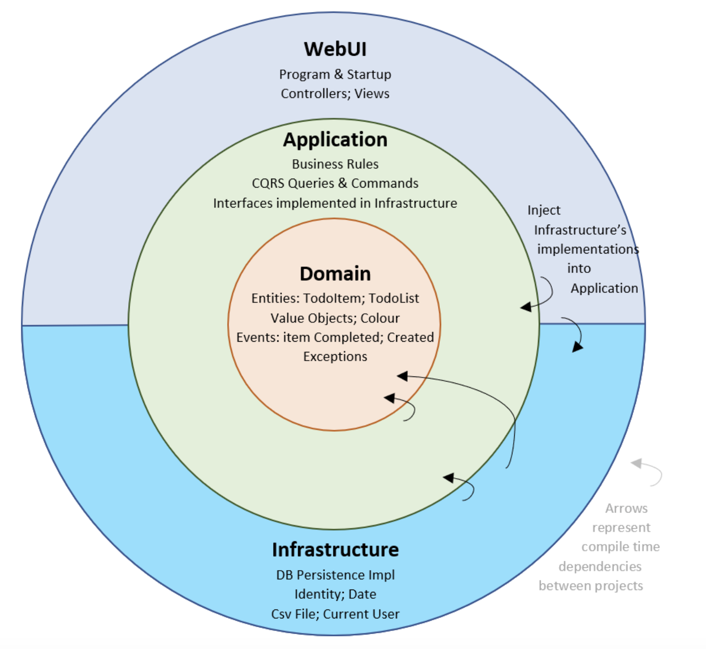

# {{ cookiecutter.project_name }}

Author: {{ cookiecutter.author_name }} <{{ cookiecutter.author_email }}>

{{ cookiecutter.description }}

## Clean Architecture Overview



## Key Features

1. Multiple Trigger Types

   - HTTP Trigger – Demonstrates how to handle HTTP requests and responses.
   - Storage Trigger – Respond to events from Google Cloud Storage, such as file creation or deletion.
   - Pub/Sub Trigger – Process messages from Google Pub/Sub topics.

1. Centralized Configuration Management

   - Load and inject environment variables from a local `.env`, `config.json` or `config.yaml` file.
   - Load and inject environment variables from `Google Storage`, `Google Secret Manager` so that settings of application will be centralised

1. Dependency Management and Testing

   - Yarn is used for efficient dependency management and packaging.
   - Jest provides a comprehensive testing framework for TypeScript, ensuring reliability and consistency of your Cloud Functions.
   - NestJS Testing Module for integration testing.

> Note: This project applies only to Cloud Run functions—formerly Cloud Functions (2nd gen). Find more details in [Cloud Run Function](https://cloud.google.com/functions/docs/create-deploy-http-typescript)

______________________________________________________________________

## Prerequisites

### Required Programs

Before setting up this project, ensure the following programs are installed:

### Xcode CLI

To use homebrew to install Python packages, you need a compiler

```bash
xcode-select --install
```

### Homebrew

Homebrew is a package manager for macOS, used to install other tools like `asdf` and `jq`.

Installation:

```bash
/bin/bash -c "$(curl -fsSL https://raw.githubusercontent.com/Homebrew/install/HEAD/install.sh)"
```

### jq

jq is a lightweight and flexible command-line JSON processor, used for automating JSON file generation.

Installation:

```bash
brew install jq
```

### asdf

asdf is a version manager for multiple runtimes like Python, Node.js, Java, Go, etc.

Installation:

```bash
brew install asdf
```

- Add asdf to your shell by adding the following lines to your shell configuration (~/.zshrc or ~/.bashrc):

  For `~/.zshrc`:

  ```bash
  echo '. $(brew --prefix asdf)/libexec/asdf.sh' >> ~/.zshrc
  ```

  For `~/.bashrc`:

  ```bash
  echo '. $(brew --prefix asdf)/libexec/asdf.sh' >> ~/.bashrc
  ```

- After adding the line, reload the shell configuration file for the changes to take effect:

  For `~/.zshrc`:

  ```bash
  source ~/.zshrc
  ```

  For `~/.bashrc`:

  ```bash
  source ~/.bashrc
  ```

### node.js

- Install the Nodejs plugin and Nodejs 22.15.0 using asdf:

  ```bash
  asdf plugin add nodejs
  asdf install nodejs 22.15.0
  asdf global nodejs 22.15.0
  ```

- Verify the installation:

  ```bash
  node --version
  ```

### YARN

- Yarn is a fast, reliable, and secure dependency management tool for Node.js, optimized for performance and consistency. Install Yarn globally using npm:

  ```bash
  npm install -g yarn
  ```

- Verify the installation:

  ```bash
  yarn --version
  ```

### Nest.js

- NestJS CLI is a command-line interface tool that helps you initialize, develop, and maintain your NestJS applications with a set of powerful commands. Install the NestJS CLI globally using yarn:

  ```bash
  yarn global add @nestjs/cli
  ```

- Verify the installation:

  ```bash
  nest --version
  ```

### Google Cloud CLI

- Install Google Cloud CLI running the following commands. Find more details in [gcloud CLI](https://cloud.google.com/sdk/docs/install)

  ```bash
  curl https://dl.google.com/dl/cloudsdk/channels/rapid/downloads/google-cloud-cli-darwin-arm.tar.gz -o GCLOUDCLI.tar.gz

  tar -xvf GCLOUDCLI.tar.gz

  ./google-cloud-sdk/install.sh
  ```

- To initialize the gcloud CLI, run gcloud init:

  ```bash
  ./google-cloud-sdk/bin/gcloud init
  ```

- Verify the installation:

  ```bash
  gcloud --version
  ```

- Update and install gcloud components with the following command:

  ```bash
  gcloud components update
  ```

## Setting Up the Project

1. Clone the Repository:

   ```bash
   git clone https://github.com/nodejs-projects-kenanhancer/{{ cookiecutter.project_slug }}.git
   cd {{ cookiecutter.project_slug }}
   ```

1. Create **.env** file to load application settings:

   ```bash
   BASIC_SETTINGS__ENVIRONMENT=dev
   BASIC_SETTINGS__GCP_PROJECT_ID=<GCP-PROJECT-ID>
   BASIC_SETTINGS__GCP_PROJECT_NUMBER=<GCP-PROJECT-NUMBER>
   BASIC_SETTINGS__APP_CONFIG_BUCKET=app-config-<GCP-PROJECT-NUMBER>-dev
   BASIC_SETTINGS__GCP_SERVICE_NAME=say_hello_config
   ```

1. Install Dependencies:

   ```bash
   # Install all dependencies including dev dependencies
   yarn install

   # Install/Reinstall pre-commit hooks
   rm -rf .git/hooks/*  # Remove all git hooks
   uv run pre-commit clean # Clean any existing pre-commit
   uv run pre-commit uninstall # Uninstall any remaining hooks
   uv run pre-commit install --overwrite  # Install hooks fresh
   ```

1. Run Tests: Run the tests using pytest:

   ```bash
   yarn run test
   ```

1. Sync after team members update dependencies

   ```bash
   git pull # Get latest changes
   uv sync # Update environment from uv.lock
   ```

## Running Pre-commit hooks

- This command executes all the pre-commit hooks defined in your .pre-commit-config.yaml file on all files in your repository, regardless of whether they have been modified or staged for commit. It ensures that your entire codebase adheres to the standards and checks specified by your pre-commit hooks.

  ```bash
  # Run all pre-commit hooks
  uv run pre-commit run --all-files

  # OR

  # Run with verbose output
  uv run pre-commit run --all-files --verbose
  ```

- Additional Command Options

  ```bash
  # Run specific hooks
  uv run pre-commit run black --all-files
  uv run pre-commit run pretty-format-json --all-files
  uv run pre-commit run pretty-format-json --files config.json
  ```

## Testing Google Cloud Function

- List Services(Cloud Function)

  ```bash
  gcloud run services list \
    --project=<GCP-PROJECT-ID> \
    --region=europe-north1
  ```

- How to Get Logs for a Gen2 Cloud Function

  ```bash
  gcloud functions logs read say-hello-dev \
    --project=<GCP-PROJECT-ID> \
    --region=europe-north1
  ```

  OR

  ```bash
  gcloud functions logs read say-hello-dev \
    --project=<GCP-PROJECT-ID> \
    --region=europe-north1 \
    --limit=5 \
    --format=json
  ```

- Test Cloud Function

  ```bash
  curl -m 70 -X GET https://europe-north1-<GCP-PROJECT-ID>.cloudfunctions.net/say-hello-dev \
  -H "Authorization: bearer $(gcloud auth print-identity-token)"
  ```

## GCP CLI Commands Quick Reference

### Project Management

```bash
gcloud config list                                    # View current configuration
gcloud config set project <GCP-PROJECT-ID>                # Switch active project
gcloud config configurations create <CONFIGURATION_NAME> 
gcloud projects list                                  # List all projects
```

### IAM & Service Accounts

```bash
# List and Describe
gcloud iam service-accounts list                                    # List service accounts
gcloud iam service-accounts describe <SERVICE-ACCOUNT-EMAIL>        # Get details of a service account
gcloud iam service-accounts get-iam-policy <SERVICE-ACCOUNT-EMAIL>  # Get IAM policy for service account
gcloud iam roles list --project=<GCP-PROJECT-ID>                        # List IAM roles
gcloud projects get-iam-policy                                      # View project IAM policy

# Enable/Disable
gcloud iam service-accounts enable <SERVICE-ACCOUNT-EMAIL>         # Enable service account
gcloud iam service-accounts disable <SERVICE-ACCOUNT-EMAIL>        # Disable service account

# Update
gcloud iam service-accounts update <SERVICE-ACCOUNT-EMAIL> \       # Update display name
    --display-name="New Display Name"

# Create and Delete
gcloud iam service-accounts create <ACCOUNT-ID>                    # Create new service account
gcloud iam service-accounts delete <SERVICE-ACCOUNT-EMAIL>         # Delete service account

# Keys Management
gcloud iam service-accounts keys list \                            # List keys for service account
    --iam-account=<SERVICE-ACCOUNT-EMAIL>
gcloud iam service-accounts keys create key.json \                 # Create new key
    --iam-account=<SERVICE-ACCOUNT-EMAIL>
cat key.json | base64                                              # Display key content (for GitHub secret)

gcloud iam service-accounts keys create - \                        # To print out  directly to terminal
    --iam-account=<SERVICE-ACCOUNT-EMAIL> \
    --format='get(privateKeyData)'
gcloud iam service-accounts keys delete <KEY-ID> \                 # Delete key
    --iam-account=<SERVICE-ACCOUNT-EMAIL>

# IAM Policy
gcloud projects add-iam-policy-binding <GCP-PROJECT-ID> \              # Grant role to service account
    --member="serviceAccount:<SERVICE-ACCOUNT-EMAIL>" \
    --role="<ROLE-ID>"
```

### Storage Operations

```bash
gsutil ls                                  # List buckets
gsutil ls gs://<BUCKET-NAME>               # List bucket contents
gsutil cp <FILE> gs://<BUCKET-NAME>        # Upload file
```

### Compute Engine

```bash
gcloud compute instances list [NAMES]      # List VM instances
gcloud compute zones list                  # List available zones
gcloud compute images list                 # List available images
```

### Kubernetes (GKE)

```bash
gcloud container clusters list                              # List GKE clusters
gcloud container clusters get-credentials <CLUSTER-NAME>    # Configure kubectl
```

### Common Options

- `--project=<GCP-PROJECT-ID>`: Specify project
- `--format=[json|yaml]`: Change output format
- `--filter="<EXPRESSION>"`: Filter results

### Configuration Info

```bash
gcloud info                               # Display SDK configuration details
```

### Tips

- Use `gcloud help <COMMAND>` for detailed documentation
- Add `--quiet` or `-q` to skip confirmation prompts
- Use `--format=json | jq` for JSON parsing

### Environment Setup

```bash
gcloud init                               # Initialize configuration
gcloud auth login                         # Authenticate account
```

## Terraform Deployment from local for **terraform**

```bash
cd ./{{cookiecutter.project_slug}}
source ./scripts/init_terraform.sh
gcp_project_id=<GCP-PROJECT-ID>
gcp_bucket_name=terraform-state-bucket
terraform_dir=terraform
encryption_key="ch4xHNN/6Jlnt7wzZMD0nA3/vjb13YOmUHqhTrZc84c="
init_terraform -b $gcp_bucket_name -p $gcp_project_id -d $terraform_dir -k $encryption_key
terraform -chdir=terraform plan
terraform -chdir=terraform apply
```
